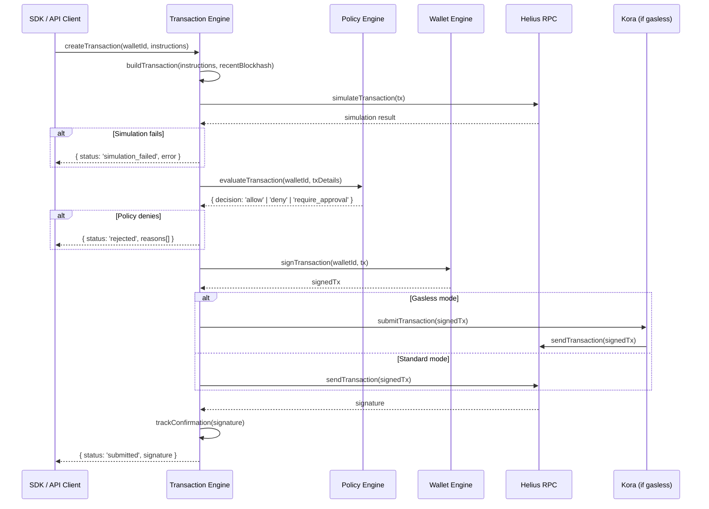
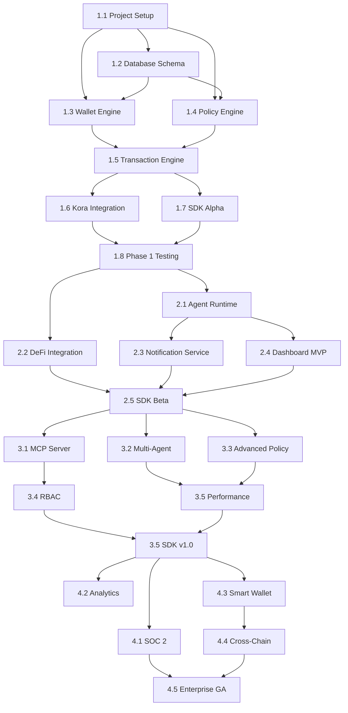

# Implementation Plan
# Solana AI Agent Wallet Platform — "SolAgent"

> **Version**: 1.0  
> **Date**: February 2026  
> **Status**: Pre-Development  
>
> **Related Documents**:  
> - [PRD](file:///Users/mac/Downloads/solana-agent/PRD.md) — Requirements this plan implements  
> - [System Architecture](file:///Users/mac/Downloads/solana-agent/SYSTEM_ARCHITECTURE.md) — Technical designs referenced throughout  
> - [Roadmap](file:///Users/mac/Downloads/solana-agent/ROADMAP.md) — Milestone tracking and phase status

---

## How to Use This Document

Each phase below corresponds directly to a **phase in the [Roadmap](file:///Users/mac/Downloads/solana-agent/ROADMAP.md)**. Within each phase, work items map to **functional requirements in the [PRD](file:///Users/mac/Downloads/solana-agent/PRD.md)** (FR-xxx) and **components in the [System Architecture](file:///Users/mac/Downloads/solana-agent/SYSTEM_ARCHITECTURE.md)** (§x.x).

> [!IMPORTANT]
> When completing items, update the corresponding milestone status in the [Roadmap](file:///Users/mac/Downloads/solana-agent/ROADMAP.md) tracker.

---

## Phase 1: Foundation (Weeks 1-15)

> **Roadmap Reference**: [Phase 1](file:///Users/mac/Downloads/solana-agent/ROADMAP.md)  
> **Goal**: Core wallet, transaction, and policy infrastructure operational on Solana devnet.

---

### 1.1 Project Setup & Monorepo (Weeks 1-2)

> **Roadmap Milestone**: M1.1  
> **Architecture Reference**: [Appendix A — Directory Structure](file:///Users/mac/Downloads/solana-agent/SYSTEM_ARCHITECTURE.md)

#### Tasks

| # | Task | Details | PRD Ref | Status |
|---|---|---|---|---|
| 1.1.1 | Initialize Turborepo monorepo | `npx create-turbo@latest`, configure workspaces for `apps/`, `services/`, `packages/` | — | ✅ |
| 1.1.2 | Setup TypeScript config | Shared `tsconfig.base.json` with strict mode, path aliases | — | ✅ |
| 1.1.3 | Setup Bun runtime | Configure `bun.lockb`, scripts, ensure all services run on Bun | — | ✅ |
| 1.1.4 | Create `packages/common` | Shared types, constants, error classes, Zod schemas | — | ✅ |
| 1.1.5 | Create `packages/db` | Drizzle ORM setup, PostgreSQL connection, initial schema | — | ✅ |
| 1.1.6 | Create `packages/events` | Redpanda client, event schema definitions | — | ✅ |
| 1.1.7 | Setup Docker Compose | Local dev environment: PostgreSQL, Redis, Redpanda | — | ✅ |
| 1.1.8 | Setup CI/CD | GitHub Actions: lint → type-check → test → build → docker push | — | ✅ |
| 1.1.9 | Setup ESLint + Prettier | Shared config, pre-commit hooks via Husky | — | ✅ |
| 1.1.10 | Setup Vitest | Test framework with coverage reporting | — | ✅ |
| 1.1.11 | Setup environment config | `.env.example`, validation with Zod, per-service configs | — | ✅ |

#### Technical Details

**Turborepo Workspace Structure:**
```json
// turbo.json
{
  "$schema": "https://turbo.build/schema.json",
  "globalDependencies": [".env"],
  "pipeline": {
    "build": { "dependsOn": ["^build"], "outputs": ["dist/**"] },
    "dev": { "cache": false, "persistent": true },
    "test": { "dependsOn": ["build"] },
    "lint": {},
    "typecheck": { "dependsOn": ["^build"] }
  }
}
```

**Docker Compose (Local Dev):**
```yaml
services:
  postgres:
    image: postgres:16-alpine
    ports: ["5432:5432"]
    environment:
      POSTGRES_DB: solagent
      POSTGRES_USER: solagent
      POSTGRES_PASSWORD: dev_password
    volumes: ["pgdata:/var/lib/postgresql/data"]

  redis:
    image: valkey/valkey:7-alpine
    ports: ["6379:6379"]

  redpanda:
    image: redpandadata/redpanda:latest
    ports: ["9092:9092", "8081:8081"]
    command: >
      redpanda start --smp 1 --memory 512M
      --advertise-kafka-addr host:9092

volumes:
  pgdata:
```

**Acceptance Criteria:**
- [ ] `bun install` succeeds with zero errors
- [ ] `bun run build` compiles all packages and services
- [ ] `bun run test` executes with 0 failures
- [ ] `docker compose up` launches all dependencies
- [ ] CI pipeline passes on PR to main

---

### 1.2 Database Schema & Migrations (Week 2)

> **Architecture Reference**: [§4.1 — Database Schema](file:///Users/mac/Downloads/solana-agent/SYSTEM_ARCHITECTURE.md)

#### Tasks

| # | Task | PRD Ref | Status |
|---|---|---|---|
| 1.2.1 | Define Drizzle schema for `organizations` table | — | ✅ |
| 1.2.2 | Define Drizzle schema for `users` table | — | ✅ |
| 1.2.3 | Define Drizzle schema for `agents` table | [FR-507](file:///Users/mac/Downloads/solana-agent/PRD.md) | ✅ |
| 1.2.4 | Define Drizzle schema for `wallets` table | [FR-101](file:///Users/mac/Downloads/solana-agent/PRD.md) | ✅ |
| 1.2.5 | Define Drizzle schema for `policies` table | [FR-301](file:///Users/mac/Downloads/solana-agent/PRD.md) | ✅ |
| 1.2.6 | Define Drizzle schema for `transactions` table | [FR-201](file:///Users/mac/Downloads/solana-agent/PRD.md) | ✅ |
| 1.2.7 | Define Drizzle schema for `policy_evaluations` table | [FR-601](file:///Users/mac/Downloads/solana-agent/PRD.md) | ✅ |
| 1.2.8 | Define Drizzle schema for `api_keys` table | — | ✅ |
| 1.2.9 | Create initial migration (`0001_initial`) | — | ✅ |
| 1.2.10 | Add seed data script for dev environment | — | ✅ |

#### Technical Details

```typescript
// packages/db/schema/wallets.ts
import { pgTable, uuid, text, timestamp, pgEnum } from 'drizzle-orm/pg-core';

export const walletStatusEnum = pgEnum('wallet_status', ['active', 'frozen', 'recovering']);
export const keyProviderEnum = pgEnum('key_provider', ['turnkey', 'crossmint', 'privy', 'local']);
export const networkEnum = pgEnum('network', ['mainnet-beta', 'devnet', 'testnet']);

export const wallets = pgTable('wallets', {
  id: uuid('id').primaryKey().defaultRandom(),
  agentId: uuid('agent_id').references(() => agents.id).notNull(),
  publicKey: text('public_key').unique().notNull(),
  keyProvider: keyProviderEnum('key_provider').notNull(),
  keyProviderRef: text('key_provider_ref').notNull(),
  network: networkEnum('network').notNull().default('devnet'),
  label: text('label').notNull(),
  status: walletStatusEnum('status').notNull().default('active'),
  createdAt: timestamp('created_at').defaultNow().notNull(),
});
```

---

### 1.3 Wallet Engine Service (Weeks 3-5)

> **Roadmap Milestone**: M1.2  
> **Architecture Reference**: [§3.2 — Wallet Engine](file:///Users/mac/Downloads/solana-agent/SYSTEM_ARCHITECTURE.md)  
> **PRD Reference**: [FR-101 through FR-107](file:///Users/mac/Downloads/solana-agent/PRD.md)

#### Tasks

| # | Task | PRD Ref | Status |
|---|---|---|---|
| 1.3.1 | Scaffold `wallet-engine-svc` Hono app | — | ✅ |
| 1.3.2 | Implement `KeyProvider` interface | [FR-103](file:///Users/mac/Downloads/solana-agent/PRD.md) | ✅ |
| 1.3.3 | Implement `LocalProvider` (dev/test) | [FR-103](file:///Users/mac/Downloads/solana-agent/PRD.md) | ✅ |
| 1.3.4 | Implement `TurnkeyProvider` | [FR-103](file:///Users/mac/Downloads/solana-agent/PRD.md) | ✅ |
| 1.3.5 | Implement wallet CRUD endpoints | [FR-101](file:///Users/mac/Downloads/solana-agent/PRD.md) | ✅ |
| 1.3.6 | Implement balance tracking + Redis cache | [FR-101](file:///Users/mac/Downloads/solana-agent/PRD.md) | ✅ |
| 1.3.7 | Implement ATA (Associated Token Account) manager | [FR-106](file:///Users/mac/Downloads/solana-agent/PRD.md) | ✅ |
| 1.3.8 | Implement HD wallet derivation | [FR-107](file:///Users/mac/Downloads/solana-agent/PRD.md) | ✅ |
| 1.3.9 | Implement wallet import/export | [FR-106](file:///Users/mac/Downloads/solana-agent/PRD.md) | ✅ |
| 1.3.10 | Write unit tests (>90% coverage) | — | ✅ |
| 1.3.11 | Write integration tests against devnet | — | ✅ |

#### API Endpoints (Wallet Engine)

```
POST   /api/v1/wallets                    → createWallet()
GET    /api/v1/wallets/:walletId          → getWallet()
GET    /api/v1/wallets/:walletId/balance  → getBalance()
DELETE /api/v1/wallets/:walletId          → deactivateWallet()
POST   /api/v1/wallets/:walletId/recover  → initiateRecovery()
POST   /api/v1/wallets/:walletId/sign     → signTransaction() [internal only]
```

#### Dependencies

| Package | Version | Purpose |
|---|---|---|
| `@solana/web3.js` | 2.x | Solana interactions |
| `@turnkey/sdk-server` | latest | Turnkey key management |
| `@solana/spl-token` | 0.4.x | Token account management |
| `hono` | 4.x | HTTP framework |
| `drizzle-orm` | latest | Database queries |
| `ioredis` | 5.x | Redis client |

---

### 1.4 Policy Engine Service (Weeks 3-5)

> **Roadmap Milestone**: M1.3  
> **Architecture Reference**: [§3.3 — Policy Engine](file:///Users/mac/Downloads/solana-agent/SYSTEM_ARCHITECTURE.md)  
> **PRD Reference**: [FR-301 through FR-308](file:///Users/mac/Downloads/solana-agent/PRD.md)

#### Tasks

| # | Task | PRD Ref | Status |
|---|---|---|---|
| 1.4.1 | Scaffold `policy-engine-svc` Hono app | — | ✅ |
| 1.4.2 | Define `PolicyRule` Zod schemas | [FR-301](file:///Users/mac/Downloads/solana-agent/PRD.md) | ✅ |
| 1.4.3 | Implement policy CRUD endpoints | [FR-301](file:///Users/mac/Downloads/solana-agent/PRD.md) | ✅ |
| 1.4.4 | Implement `spending_limit` rule evaluator | [FR-301](file:///Users/mac/Downloads/solana-agent/PRD.md) | ✅ |
| 1.4.5 | Implement `program_allowlist` rule evaluator | [FR-302](file:///Users/mac/Downloads/solana-agent/PRD.md) | ✅ |
| 1.4.6 | Implement `token_allowlist` rule evaluator | [FR-303](file:///Users/mac/Downloads/solana-agent/PRD.md) | ✅ |
| 1.4.7 | Implement `address_blocklist` rule evaluator | [FR-304](file:///Users/mac/Downloads/solana-agent/PRD.md) | ✅ |
| 1.4.8 | Implement policy evaluation pipeline | [FR-301](file:///Users/mac/Downloads/solana-agent/PRD.md) | ✅ |
| 1.4.9 | Implement Redis policy cache with invalidation | [FR-307](file:///Users/mac/Downloads/solana-agent/PRD.md) | ✅ |
| 1.4.10 | Implement policy version tracking | [FR-308](file:///Users/mac/Downloads/solana-agent/PRD.md) | ✅ |
| 1.4.11 | Implement audit event publishing to Redpanda | [FR-601](file:///Users/mac/Downloads/solana-agent/PRD.md) | ✅ |
| 1.4.12 | Write unit tests for each rule evaluator | — | ✅ |
| 1.4.13 | Write integration tests with Redis | — | ✅ |

#### Technical Details — Policy Evaluation Flow

```typescript
// services/policy-engine/src/evaluator.ts
export async function evaluateTransaction(
  walletId: string,
  txDetails: TransactionDetails
): Promise<PolicyEvaluation> {
  // 1. Fetch active policies (cache-first)
  const policies = await getPoliciesForWallet(walletId);

  // 2. Evaluate each policy rule
  const results: RuleResult[] = [];
  for (const policy of policies) {
    for (const rule of policy.rules) {
      const result = await evaluateRule(rule, txDetails);
      results.push(result);

      // Fail-fast on DENY
      if (result.decision === 'deny') {
        await publishAuditEvent('deny', walletId, txDetails, results);
        return { decision: 'deny', reasons: results.filter(r => r.decision === 'deny').map(r => r.reason) };
      }
    }
  }

  // 3. Check for REQUIRE_APPROVAL
  const approvalRequired = results.find(r => r.decision === 'require_approval');
  if (approvalRequired) {
    await publishAuditEvent('require_approval', walletId, txDetails, results);
    return { decision: 'require_approval', approvalId: generateApprovalId() };
  }

  // 4. All passed
  await publishAuditEvent('allow', walletId, txDetails, results);
  return { decision: 'allow', reasons: [] };
}
```

---

### 1.5 Transaction Engine Service (Weeks 5-8)

> **Roadmap Milestone**: M1.4  
> **Architecture Reference**: [§3.4 — Transaction Engine](file:///Users/mac/Downloads/solana-agent/SYSTEM_ARCHITECTURE.md)  
> **PRD Reference**: [FR-201 through FR-207](file:///Users/mac/Downloads/solana-agent/PRD.md)

#### Tasks

| # | Task | PRD Ref | Status |
|---|---|---|---|
| 1.5.1 | Scaffold `transaction-engine-svc` Hono app | — | ✅ |
| 1.5.2 | Implement transaction builder (instruction composition) | [FR-201](file:///Users/mac/Downloads/solana-agent/PRD.md) | ✅ |
| 1.5.3 | Implement `simulateTransaction` integration | [FR-202](file:///Users/mac/Downloads/solana-agent/PRD.md) | ✅ |
| 1.5.4 | Implement signing orchestrator (calls Wallet Engine) | [FR-203](file:///Users/mac/Downloads/solana-agent/PRD.md) | ✅ |
| 1.5.5 | Implement transaction submission with retry logic | [FR-204](file:///Users/mac/Downloads/solana-agent/PRD.md) | ✅ |
| 1.5.6 | Implement confirmation tracker (polling + webhook) | [FR-204](file:///Users/mac/Downloads/solana-agent/PRD.md) | ✅ |
| 1.5.7 | Implement priority fee calculator | [FR-206](file:///Users/mac/Downloads/solana-agent/PRD.md) | ✅ |
| 1.5.8 | Implement versioned transactions (V0) support | [FR-205](file:///Users/mac/Downloads/solana-agent/PRD.md) | ✅ |
| 1.5.9 | Implement transaction lifecycle state machine | — | ✅ |
| 1.5.10 | Implement transaction event publishing to Redpanda | — | ✅ |
| 1.5.11 | Wire up policy engine evaluation before signing | — | ✅ |
| 1.5.12 | Write unit tests for builder, simulator, retry | — | ✅ |
| 1.5.13 | Write integration tests on devnet | — | ✅ |

#### Transaction Lifecycle Integration



---

### 1.6 Kora Fee Relayer Integration (Weeks 8-10)

> **Roadmap Milestone**: M1.5  
> **Architecture Reference**: [§3.4 — Kora](file:///Users/mac/Downloads/solana-agent/SYSTEM_ARCHITECTURE.md)  
> **PRD Reference**: [FR-207](file:///Users/mac/Downloads/solana-agent/PRD.md)

#### Tasks

| # | Task | PRD Ref | Status |
|---|---|---|---|
| 1.6.1 | Deploy local Kora node via Docker | [FR-207](file:///Users/mac/Downloads/solana-agent/PRD.md) | ✅ |
| 1.6.2 | Configure `kora.toml` with token/program allowlists | [FR-207](file:///Users/mac/Downloads/solana-agent/PRD.md) | ✅ |
| 1.6.3 | Implement Kora client in Transaction Engine | [FR-207](file:///Users/mac/Downloads/solana-agent/PRD.md) | ✅ |
| 1.6.4 | Implement gasless transaction flow (agent pays no gas) | [FR-207](file:///Users/mac/Downloads/solana-agent/PRD.md) | ✅ |
| 1.6.5 | Implement fee relayer balance monitoring | — | ✅ |
| 1.6.6 | Add Kora to Docker Compose for local dev | — | ✅ |
| 1.6.7 | Write integration tests for gasless flow on devnet | — | ✅ |

#### Kora Configuration

```toml
# infrastructure/kora/kora.toml
[server]
port = 8911
log_level = "info"

[solana]
rpc_url = "https://devnet.helius-rpc.com/?api-key=YOUR_KEY"
commitment = "confirmed"

[signer]
type = "local"  # "turnkey" or "privy" for production
private_key_path = "./fee-payer.json"

[validation]
token_allowlist = [
  "So11111111111111111111111111111111111111112",   # SOL
  "EPjFWdd5AufqSSqeM2qN1xzybapC8G4wEGGkZwyTDt1v", # USDC
]
program_allowlist = [
  "11111111111111111111111111111111",              # System Program
  "TokenkegQfeZyiNwAJbNbGKPFXCWuBvf9Ss623VQ5DA",  # Token Program
  "JUP6LkbZbjS1jKKwapdHNy74zcZ3tLUZoi5QNyVTaV4",  # Jupiter
]
max_transaction_fee_lamports = 100000  # 0.0001 SOL
```

---

### 1.7 SDK Alpha (Weeks 8-10)

> **Roadmap Milestone**: M1.6  
> **PRD Reference**: [§6.3 — SDK Interface](file:///Users/mac/Downloads/solana-agent/PRD.md)

#### Tasks

| # | Task | PRD Ref | Status |
|---|---|---|---|
| 1.7.1 | Scaffold `packages/sdk` with TypeScript + bundling | — | ✅ |
| 1.7.2 | Implement `SolAgent` client class | [US-001](file:///Users/mac/Downloads/solana-agent/PRD.md) | ✅ |
| 1.7.3 | Implement `wallet.create()`, `wallet.get()`, `wallet.balance()` | [US-001](file:///Users/mac/Downloads/solana-agent/PRD.md) | ✅ |
| 1.7.4 | Implement `transaction.submit()`, `transaction.simulate()` | [US-004](file:///Users/mac/Downloads/solana-agent/PRD.md) | ✅ |
| 1.7.5 | Implement `policy.create()`, `policy.update()` | [US-002](file:///Users/mac/Downloads/solana-agent/PRD.md) | ✅ |
| 1.7.6 | Implement error handling + retry logic | — | ✅ |
| 1.7.7 | Write SDK documentation (TSDoc + usage examples) | — | ✅ |
| 1.7.8 | Publish to npm as `@solagent/sdk@0.1.0-alpha` | — | ✅ |

---

### 1.8 Phase 1 Integration Testing (Weeks 10-15)

> **Roadmap Milestone**: M1.7, M1.8

#### Test Scenarios

| # | Test Scenario | Services Involved | Status |
|---|---|---|---|
| T1.1 | Create wallet via SDK → verify on devnet | SDK, Wallet Engine, Helius | ✅ |
| T1.2 | Create policy → submit tx → verify policy allows | SDK, Policy Engine, TX Engine | ✅ |
| T1.3 | Create spending limit → exceed it → verify denial | SDK, Policy Engine, TX Engine | ✅ |
| T1.4 | Submit gasless transaction → verify Kora pays fees | SDK, TX Engine, Kora, Helius | ✅ |
| T1.5 | Simulate failing transaction → verify error response | SDK, TX Engine, Helius | ✅ |
| T1.6 | Transaction retry on blockhash expiry | TX Engine, Helius | ✅ |
| T1.7 | Policy hot-reload → verify new policy applies | SDK, Policy Engine, Redis | ✅ |
| T1.8 | Emergency wallet freeze → verify tx blocked | SDK, Wallet Engine, TX Engine | ✅ |

---

## Phase 2: Intelligence (Weeks 13-26)

> **Roadmap Reference**: [Phase 2](file:///Users/mac/Downloads/solana-agent/ROADMAP.md)  
> **Goal**: AI agent runtime, DeFi integrations, dashboard, and real-time monitoring.

---

### 2.1 Agent Runtime Service (Weeks 13-16)

> **Roadmap Milestone**: M2.1  
> **Architecture Reference**: [§3.1 — Agent Runtime](file:///Users/mac/Downloads/solana-agent/SYSTEM_ARCHITECTURE.md)  
> **PRD Reference**: [FR-501 through FR-507](file:///Users/mac/Downloads/solana-agent/PRD.md)

#### Tasks

| # | Task | PRD Ref | Status |
|---|---|---|---|
| 2.1.1 | Scaffold `agent-runtime-svc` Hono app | — | ✅ |
| 2.1.2 | Implement `AgentFramework` interface | [FR-502](file:///Users/mac/Downloads/solana-agent/PRD.md) | ✅ |
| 2.1.3 | Implement LangChain adapter | [FR-502](file:///Users/mac/Downloads/solana-agent/PRD.md) | ✅ |
| 2.1.4 | Implement Vercel AI SDK adapter | [FR-502](file:///Users/mac/Downloads/solana-agent/PRD.md) | ✅ |
| 2.1.5 | Implement Eliza adapter | [FR-502](file:///Users/mac/Downloads/solana-agent/PRD.md) | ✅ |
| 2.1.6 | Implement Tool Registry with dynamic registration | [FR-504](file:///Users/mac/Downloads/solana-agent/PRD.md) | ✅ |
| 2.1.7 | Create built-in tools: `transfer`, `getBalance`, `swap` | [FR-504](file:///Users/mac/Downloads/solana-agent/PRD.md) | ✅ |
| 2.1.8 | Implement agent state persistence (PostgreSQL + Redis) | [FR-505](file:///Users/mac/Downloads/solana-agent/PRD.md) | ✅ |
| 2.1.9 | Implement agent lifecycle (create/start/pause/resume/stop/destroy) | [FR-507](file:///Users/mac/Downloads/solana-agent/PRD.md) | ✅ |
| 2.1.10 | Implement sandboxed execution (V8 isolate or worker) | [FR-507](file:///Users/mac/Downloads/solana-agent/PRD.md) | ✅ |
| 2.1.11 | Implement LLM provider abstraction (OpenAI, Anthropic) | [FR-501](file:///Users/mac/Downloads/solana-agent/PRD.md) | ✅ |
| 2.1.12 | Write unit tests for each adapter | — | ✅ |
| 2.1.13 | Write integration tests: agent runs and executes tools | — | ✅ |

---

### 2.2 DeFi Integration Service (Weeks 13-20)

> **Roadmap Milestone**: M2.2, M2.3, M2.4  
> **Architecture Reference**: [§3.5 — DeFi Integration](file:///Users/mac/Downloads/solana-agent/SYSTEM_ARCHITECTURE.md)  
> **PRD Reference**: [FR-401 through FR-407](file:///Users/mac/Downloads/solana-agent/PRD.md)

#### Tasks

| # | Task | Protocol | PRD Ref | Status |
|---|---|---|---|---|
| 2.2.1 | Scaffold `defi-integration-svc` | — | — | ✅ |
| 2.2.2 | Implement `DeFiProtocolAdapter` interface | — | — | ✅ |
| 2.2.3 | Implement Jupiter swap adapter (quote + execute) | Jupiter | [FR-401](file:///Users/mac/Downloads/solana-agent/PRD.md) | ✅ |
| 2.2.4 | Implement Raydium AMM adapter | Raydium | [FR-402](file:///Users/mac/Downloads/solana-agent/PRD.md) | ✅ |
| 2.2.5 | Implement Orca Whirlpools adapter | Orca | [FR-402](file:///Users/mac/Downloads/solana-agent/PRD.md) | ✅ |
| 2.2.6 | Implement Marinade staking adapter | Marinade | [FR-403](file:///Users/mac/Downloads/solana-agent/PRD.md) | ✅ |
| 2.2.7 | Implement Solend lending adapter | Solend | [FR-404](file:///Users/mac/Downloads/solana-agent/PRD.md) | ✅ |
| 2.2.8 | Implement Metaplex NFT adapter | Metaplex | [FR-405](file:///Users/mac/Downloads/solana-agent/PRD.md) | ✅ |
| 2.2.9 | Implement SPL token transfer with auto-ATA | — | [FR-406](file:///Users/mac/Downloads/solana-agent/PRD.md) | ✅ |
| 2.2.10 | Integrate Pyth price feeds | Pyth | [FR-407](file:///Users/mac/Downloads/solana-agent/PRD.md) | ✅ |
| 2.2.11 | Write unit tests per adapter | — | — | ✅ |
| 2.2.12 | Write devnet integration tests | — | — | ✅ |

---

### 2.3 Notification Service (Weeks 16-18)

> **Roadmap Milestone**: M2.5  
> **Architecture Reference**: [§3.6 — Notification Service](file:///Users/mac/Downloads/solana-agent/SYSTEM_ARCHITECTURE.md)  
> **PRD Reference**: [FR-601 through FR-604](file:///Users/mac/Downloads/solana-agent/PRD.md)

#### Tasks

| # | Task | PRD Ref | Status |
|---|---|---|---|
| 2.3.1 | Scaffold `notification-svc` | — | ✅ |
| 2.3.2 | Implement Redpanda consumer for transaction events | [FR-601](file:///Users/mac/Downloads/solana-agent/PRD.md) | ✅ |
| 2.3.3 | Implement WebSocket hub (Hono WebSocket upgrade) | [FR-603](file:///Users/mac/.gemини/antigravity/scratch/solana-agent/PRD.md) | ✅ |
| 2.3.4 | Implement webhook dispatcher with HMAC signing | [FR-604](file:///Users/mac/Downloads/solana-agent/PRD.md) | ✅ |
| 2.3.5 | Implement alert router (PagerDuty, Slack) | [FR-604](file:///Users/mac/Downloads/solana-agent/PRD.md) | ✅ |
| 2.3.6 | Implement audit event writer (ClickHouse + S3) | [FR-601](file:///Users/mac/Downloads/solana-agent/PRD.md) | ✅ |
| 2.3.7 | Write integration tests | — | ✅ |

---

### 2.4 Dashboard MVP (Weeks 16-22)

> **Roadmap Milestone**: M2.6  
> **Architecture Reference**: [§3.7 — Dashboard](file:///Users/mac/Downloads/solana-agent/SYSTEM_ARCHITECTURE.md)  
> **PRD Reference**: [FR-605](file:///Users/mac/Downloads/solana-agent/PRD.md)

#### Tasks

| # | Task | Page | Status |
|---|---|---|---|
| 2.4.1 | Initialize Next.js 15 app with shadcn/ui | — | ✅ |
| 2.4.2 | Implement authentication flow (API key login) | Settings | ✅ |
| 2.4.3 | Build system overview dashboard page | `/dashboard` | ✅ |
| 2.4.4 | Build agents list + create/pause/destroy page | `/dashboard/agents` | ✅ |
| 2.4.5 | Build agent detail page (config, logs, wallet) | `/dashboard/agents/:id` | ✅ |
| 2.4.6 | Build wallets list page with balances | `/dashboard/wallets` | ✅ |
| 2.4.7 | Build transaction log with filters/search | `/dashboard/transactions` | ✅ |
| 2.4.8 | Build policy management page | `/dashboard/policies` | ✅ |
| 2.4.9 | Embed Grafana panels for monitoring | `/dashboard/monitoring` | ✅ |
| 2.4.10 | Implement real-time updates via WebSocket | — | ✅ |
| 2.4.11 | Write E2E tests (Playwright) | — | ✅ |

---

### 2.5 SDK Beta + Observability (Weeks 20-26)

> **Roadmap Milestone**: M2.7, M2.8, M2.9

#### Tasks

| # | Task | Status |
|---|---|---|
| 2.5.1 | Add agent methods to SDK (`agent.create()`, `agent.pause()`, etc.) | ✅ |
| 2.5.2 | Add DeFi methods to SDK (`defi.swap()`, `defi.stake()`, etc.) | ✅ |
| 2.5.3 | Add WebSocket event subscription to SDK | ✅ |
| 2.5.4 | Deploy OpenTelemetry Collector + Prometheus + Grafana | ✅ |
| 2.5.5 | Instrument all services with OTel SDK | ✅ |
| 2.5.6 | Create Grafana dashboards (system, tx, policy, wallet, infra) | ✅ |
| 2.5.7 | Configure Alertmanager rules per [§8.2 SLOs](file:///Users/mac/Downloads/solana-agent/SYSTEM_ARCHITECTURE.md) | ✅ |
| 2.5.8 | Run load test: 1,000 agents, 100 TPS, 1 hour | ✅ |
| 2.5.9 | Run security pentest (third-party or internal) | ✅ |
| 2.5.10 | Publish `@solagent/sdk@0.5.0-beta` | ✅ |
| 2.5.11 | Phase 2 sign-off and mainnet soft-launch | ✅ |

---

## Phase 3: Scale (Weeks 24-38)

> **Roadmap Reference**: [Phase 3](file:///Users/mac/Downloads/solana-agent/ROADMAP.md)  
> **Goal**: MCP integration, multi-agent orchestration, enterprise auth, SDK v1.0 GA.

---

### 3.1 MCP Server (Weeks 24-28)

> **Roadmap Milestone**: M3.1  
> **PRD Reference**: [FR-503](file:///Users/mac/Downloads/solana-agent/PRD.md)

#### Tasks

| # | Task | Status |
|---|---|---|
| 3.1.1 | Scaffold `apps/mcp-server` with MCP SDK | ⬜ |
| 3.1.2 | Implement MCP resource providers (wallets, agents, policies) | ⬜ |
| 3.1.3 | Implement MCP tool providers (swap, transfer, stake) | ⬜ |
| 3.1.4 | Implement MCP prompt templates for agent operations | ⬜ |
| 3.1.5 | Write integration tests with Claude/GPT MCP clients | ⬜ |
| 3.1.6 | Write MCP server documentation | ⬜ |

---

### 3.2 Multi-Agent Orchestration (Weeks 24-28)

> **Roadmap Milestone**: M3.2  
> **PRD Reference**: [FR-506](file:///Users/mac/Downloads/solana-agent/PRD.md)

#### Tasks

| # | Task | Status |
|---|---|---|
| 3.2.1 | Design multi-agent wallet sharing model | ⬜ |
| 3.2.2 | Implement shared wallet with per-agent spending limits | ⬜ |
| 3.2.3 | Implement agent-to-agent communication channel | ⬜ |
| 3.2.4 | Implement orchestrator for sequential/parallel agent workflows | ⬜ |
| 3.2.5 | Write integration tests for multi-agent scenarios | ⬜ |

---

### 3.3 Advanced Policy Engine (Weeks 24-26)

> **Roadmap Milestone**: M3.3  
> **PRD Reference**: [FR-305, FR-306](file:///Users/mac/Downloads/solana-agent/PRD.md)

#### Tasks

| # | Task | PRD Ref | Status |
|---|---|---|---|
| 3.3.1 | Implement `time_restriction` rule evaluator | [FR-305](file:///Users/mac/Downloads/solana-agent/PRD.md) | ⬜ |
| 3.3.2 | Implement `human_approval` flow (request → approve/reject) | [FR-306](file:///Users/mac/Downloads/solana-agent/PRD.md) | ⬜ |
| 3.3.3 | Implement `rate_limit` rule with sliding window | [FR-306](file:///Users/mac/Downloads/solana-agent/PRD.md) | ⬜ |
| 3.3.4 | Implement composable policy chains (AND/OR logic) | — | ⬜ |
| 3.3.5 | Implement policy templates (pre-built common patterns) | — | ⬜ |
| 3.3.6 | Write comprehensive tests | — | ⬜ |

---

### 3.4 RBAC & Enterprise Auth (Weeks 28-32)

> **Roadmap Milestone**: M3.4  
> **PRD Reference**: [US-021](file:///Users/mac/Downloads/solana-agent/PRD.md)

#### Tasks

| # | Task | Status |
|---|---|---|
| 3.4.1 | Implement RBAC engine per [§5.3 RBAC Matrix](file:///Users/mac/Downloads/solana-agent/SYSTEM_ARCHITECTURE.md) | ⬜ |
| 3.4.2 | Add role assignment to user management | ⬜ |
| 3.4.3 | Implement permission middleware in API Gateway | ⬜ |
| 3.4.4 | Add RBAC controls to Dashboard | ⬜ |
| 3.4.5 | Write authorization tests per role | ⬜ |

---

### 3.5 Performance & SDK v1.0 (Weeks 28-38)

> **Roadmap Milestone**: M3.5, M3.6, M3.7

#### Tasks

| # | Task | Status |
|---|---|---|
| 3.5.1 | Profile and optimize policy evaluation (<10ms p99) | ⬜ |
| 3.5.2 | Optimize transaction signing path (<100ms p99) | ⬜ |
| 3.5.3 | Implement connection pooling optimization | ⬜ |
| 3.5.4 | Run load test: 5,000 agents, 500 TPS sustained | ⬜ |
| 3.5.5 | Finalize SDK v1.0 API surface (no breaking changes) | ⬜ |
| 3.5.6 | Write comprehensive SDK documentation | ⬜ |
| 3.5.7 | Create SDK quickstart guides + example projects | ⬜ |
| 3.5.8 | Publish `@solagent/sdk@1.0.0` to npm | ⬜ |
| 3.5.9 | Deploy API reference documentation site | ⬜ |
| 3.5.10 | Phase 3 sign-off | ⬜ |

---

## Phase 4: Enterprise (Weeks 36-52)

> **Roadmap Reference**: [Phase 4](file:///Users/mac/Downloads/solana-agent/ROADMAP.md)  
> **Goal**: SOC 2 compliance, on-chain smart wallet program, cross-chain, enterprise features.

---

### 4.1 SOC 2 Compliance (Weeks 36-42)

> **Roadmap Milestone**: M4.1  
> **PRD Reference**: [§4.3 — Security](file:///Users/mac/Downloads/solana-agent/PRD.md)

#### Tasks

| # | Task | Status |
|---|---|---|
| 4.1.1 | Engage SOC 2 auditor and define scope | ⬜ |
| 4.1.2 | Implement access control evidence collection | ⬜ |
| 4.1.3 | Implement change management evidence collection | ⬜ |
| 4.1.4 | Implement risk assessment documentation | ⬜ |
| 4.1.5 | Implement incident response procedures | ⬜ |
| 4.1.6 | Run pre-audit readiness assessment | ⬜ |
| 4.1.7 | Complete SOC 2 Type II audit observation period | ⬜ |

---

### 4.2 Advanced Analytics (Weeks 36-40)

> **Roadmap Milestone**: M4.2

#### Tasks

| # | Task | Status |
|---|---|---|
| 4.2.1 | Deploy ClickHouse cluster | ⬜ |
| 4.2.2 | Build ETL pipeline from Redpanda → ClickHouse | ⬜ |
| 4.2.3 | Create analytics materialized views | ⬜ |
| 4.2.4 | Build analytics dashboard pages (transaction volume, agent perf) | ⬜ |
| 4.2.5 | Implement compliance export (CSV/JSON) | ⬜ |

---

### 4.3 Smart Wallet On-Chain Program (Weeks 36-42)

> **Roadmap Milestone**: M4.3  
> **Architecture Reference**: [§2 — Component Architecture](file:///Users/mac/Downloads/solana-agent/SYSTEM_ARCHITECTURE.md)

#### Tasks

| # | Task | Status |
|---|---|---|
| 4.3.1 | Design on-chain smart wallet program (Anchor/Rust) | ⬜ |
| 4.3.2 | Implement wallet creation instruction | ⬜ |
| 4.3.3 | Implement delegated signer management | ⬜ |
| 4.3.4 | Implement on-chain spending limit enforcement | ⬜ |
| 4.3.5 | Implement on-chain program allowlist | ⬜ |
| 4.3.6 | Write Anchor tests (Rust + TypeScript) | ⬜ |
| 4.3.7 | Security audit by third-party firm (e.g., OtterSec, Neodyme) | ⬜ |
| 4.3.8 | Deploy to devnet → testnet → mainnet | ⬜ |

---

### 4.4 Cross-Chain Support (Weeks 42-46)

> **Roadmap Milestone**: M4.4

#### Tasks

| # | Task | Status |
|---|---|---|
| 4.4.1 | Abstract blockchain interface for multi-chain support | ⬜ |
| 4.4.2 | Implement EVM chain provider (ethers.js) | ⬜ |
| 4.4.3 | Implement cross-chain bridge integration (Wormhole) | ⬜ |
| 4.4.4 | Extend policy engine for multi-chain rules | ⬜ |
| 4.4.5 | Write cross-chain integration tests | ⬜ |

---

### 4.5 Enterprise Features (Weeks 42-48)

> **Roadmap Milestone**: M4.5  
> **PRD Reference**: [US-022](file:///Users/mac/Downloads/solana-agent/PRD.md)

#### Tasks

| # | Task | Status |
|---|---|---|
| 4.5.1 | Implement SSO integration (SAML 2.0, OIDC) | ⬜ |
| 4.5.2 | Implement organization management (multi-tenant) | ⬜ |
| 4.5.3 | Implement SLA monitoring and reporting | ⬜ |
| 4.5.4 | Implement enterprise onboarding flow | ⬜ |
| 4.5.5 | Create enterprise documentation | ⬜ |
| 4.5.6 | Phase 4 sign-off — Enterprise GA | ⬜ |

---

## Verification Plan

### Automated Testing

| Level | Tool | Coverage Target | Runner |
|---|---|---|---|
| Unit | Vitest | >85% | CI (every PR) |
| Integration | Vitest + Testcontainers | >70% | CI (every PR) |
| E2E (API) | Vitest + Supertest | >60% | CI (nightly) |
| E2E (Dashboard) | Playwright | >50% | CI (nightly) |
| Load | k6 | per-phase targets | Manual (phase end) |
| Security | OWASP ZAP + Snyk | 0 critical findings | CI (weekly) |
| Smart Contract | Anchor Test + Trident | >95% | CI (every PR) |

### Manual Verification

| Check | Frequency | Owner |
|---|---|---|
| Devnet end-to-end demo | End of each phase | Engineering |
| Security penetration test | End of Phase 2, 4 | Security team / third-party |
| Smart contract audit | Pre-mainnet deploy | Third-party (OtterSec) |
| SOC 2 readiness assessment | Phase 4 | Compliance + auditor |
| Load test sign-off | End of each phase | Engineering + SRE |

---

## Dependency Graph


