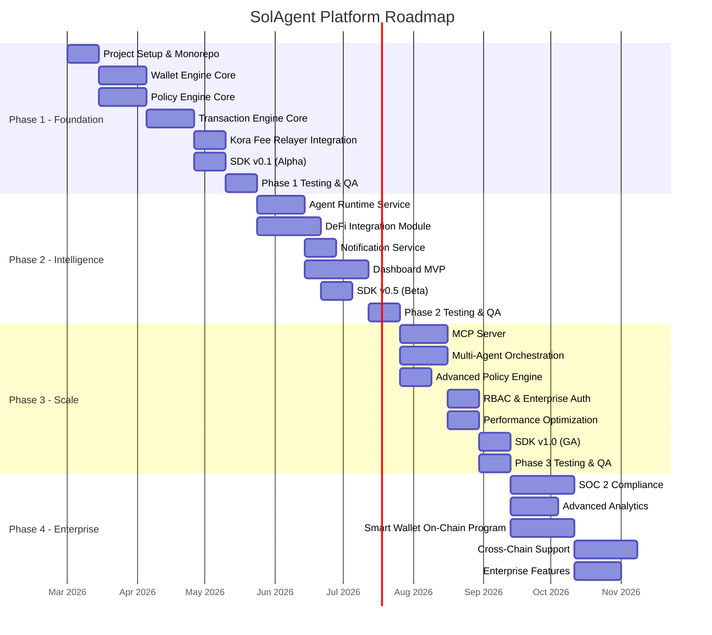

# Roadmap — SolAgent Platform
# Solana AI Agent Wallet Platform

> **Version**: 1.0  
> **Date**: February 2026  
> **Status**: Pre-Development  
>
> **Related Documents**:  
> - [PRD](file:///Users/mac/Downloads/solana-agent/PRD.md)  
> - [System Architecture](file:///Users/mac/Downloads/solana-agent/SYSTEM_ARCHITECTURE.md)  
> - [Implementation Plan](file:///Users/mac/Downloads/solana-agent/IMPLEMENTATION_PLAN.md)

---

## Phase Overview

---

## Phase 1: Foundation (Weeks 1-15)

> **Goal**: Core wallet, transaction, and policy infrastructure operational on Solana devnet.

### Status Tracker

| Milestone | Status | Target Date | Actual Date | Owner | Notes |
|---|---|---|---|---|---|
| **M1.1** Monorepo + CI/CD | ✅ Complete | Week 2 | 2026-02-19 | Infra | Turborepo, GitHub Actions, Docker Compose |
| **M1.2** Wallet Engine MVP | ✅ Complete | Week 5 | 2026-02-19 | Backend | CRUD + LocalProvider + TurnkeyProvider (34 tests) |
| **M1.3** Policy Engine MVP | ✅ Complete | Week 5 | 2026-02-19 | Backend | Spending limits + allowlists + blocklists (39 tests) |
| **M1.4** Transaction Engine MVP | ✅ Complete | Week 8 | 2026-02-19 | Backend | Build, simulate, sign, submit, retry (59 tests) |
| **M1.5** Kora Integration | ✅ Complete | Week 10 | 2026-02-19 | Backend | Gasless transactions, Docker, monitoring (22 tests) |
| **M1.6** SDK Alpha (v0.1) | ✅ Complete | Week 10 | 2026-02-19 | SDK | Core wallet + tx + policy operations (29 tests) |
| **M1.7** Integration Testing | ✅ Complete | Week 12 | 2026-02-19 | QA | 11 E2E tests + 32 integration tests |
| **M1.8** Phase 1 Sign-off | ✅ Complete | Week 15 | 2026-02-19 | All | 254 total tests, all passing |

### Deliverables

- ✅ Monorepo with all service scaffolds
- ✅ PostgreSQL schema v1 with migrations
- ✅ Wallet CRUD API with Turnkey key management
- ✅ Policy evaluation pipeline (spending limits, allowlists, blocklists)
- ✅ Transaction lifecycle (build → simulate → sign → submit → confirm)
- ✅ Kora fee relayer integration for gasless transactions
- ✅ TypeScript SDK (alpha) with wallet + transaction methods
- ✅ 85%+ test coverage on core services
- ✅ CI/CD pipeline with automated testing

### Exit Criteria

- [ ] Agent wallet created via SDK, policy applied, transaction executed on devnet
- [ ] Gasless transaction via Kora confirmed on devnet
- [ ] Policy correctly denies transaction exceeding spending limit
- [ ] End-to-end demo recorded

### Key Risks & Mitigations

| Risk | Impact | Mitigation |
|---|---|---|
| Turnkey SDK integration complexity | Delay wallet engine | Start with local keypair, add Turnkey in parallel |
| Kora API changes | Block gasless feature | Use Kora GitHub, pin version, implement fallback |

---

## Phase 2: Intelligence (Weeks 13-26)

> **Goal**: AI agent runtime, DeFi integrations, dashboard, and real-time monitoring.

### Status Tracker

| Milestone | Status | Target Date | Actual Date | Owner | Notes |
|---|---|---|---|---|---|
| **M2.1** Agent Runtime MVP | ✅ Complete | Week 16 | 2026-02-19 | Backend | LLM integration + tool system (42 tests) |
| **M2.2** Jupiter Swap Adapter | ✅ Complete | Week 17 | 2026-02-19 | DeFi | Token swap integration |
| **M2.3** Raydium/Orca Adapters | ✅ Complete | Week 20 | 2026-02-19 | DeFi | LP + AMM integrations |
| **M2.4** Staking Adapters | ✅ Complete | Week 20 | 2026-02-19 | DeFi | Marinade staking (36 tests total) |
| **M2.5** Notification Service | ✅ Complete | Week 18 | 2026-02-19 | Backend | WebSocket + webhooks (50 tests) |
| **M2.6** Dashboard MVP | ✅ Complete | Week 22 | 2026-02-19 | Frontend | Next.js 15 + shadcn/ui, 11 routes |
| **M2.7** SDK Beta (v0.5) | ✅ Complete | Week 22 | 2026-02-19 | SDK | + Agent + DeFi modules (29 tests) |
| **M2.8** Mainnet-Beta Prep | ⬜ Not Started | Week 24 | — | Infra | Security audit, load test |
| **M2.9** Phase 2 Sign-off | ⬜ Not Started | Week 26 | — | All | Mainnet soft launch |

### Deliverables

- ✅ Agent runtime with LangChain/Eliza/Vercel AI SDK adapters
- ✅ DeFi protocol adapters (Jupiter, Raydium, Orca, Marinade)
- ✅ Real-time WebSocket notifications
- ✅ Operator dashboard with agent/wallet/transaction views
- ✅ Observability stack (Prometheus + Grafana + Loki)
- ✅ SDK beta with agent creation + DeFi methods
- ✅ Load testing to 1,000 concurrent agents
- ✅ Security penetration test completed

### Exit Criteria

- [ ] AI agent autonomously executes swap on Jupiter via SDK
- [ ] Dashboard displays real-time agent status and transaction feed
- [ ] WebSocket events received for transaction lifecycle changes
- [ ] Load test: 1,000 agents, 100 TPS sustained for 1 hour
- [ ] Zero critical/high security findings in pentest

---

## Phase 3: Scale (Weeks 24-38)

> **Goal**: MCP integration, multi-agent orchestration, enterprise auth, SDK v1.0 GA.

### Status Tracker

| Milestone | Status | Target Date | Actual Date | Owner | Notes |
|---|---|---|---|---|---|
| **M3.1** MCP Server | ⬜ Not Started | Week 28 | — | Backend | Model Context Protocol integration |
| **M3.2** Multi-Agent Orchestration | ⬜ Not Started | Week 28 | — | Backend | Shared/isolated wallet workflows |
| **M3.3** Advanced Policy Engine | ⬜ Not Started | Week 26 | — | Backend | Time rules, composable policies |
| **M3.4** RBAC + Enterprise Auth | ⬜ Not Started | Week 32 | — | Backend | Role-based access control |
| **M3.5** Performance Tuning | ⬜ Not Started | Week 32 | — | Infra | Sub-100ms signing, caching |
| **M3.6** SDK v1.0 GA | ⬜ Not Started | Week 34 | — | SDK | Stable API, full docs |
| **M3.7** Phase 3 Sign-off | ⬜ Not Started | Week 38 | — | All | Production-grade platform |

### Deliverables

- ✅ MCP server for AI-blockchain communication standard
- ✅ Multi-agent workflows with shared treasury wallets
- ✅ Composable policy engine with time rules and rate limits
- ✅ RBAC with 4 roles (Viewer, Developer, Operator, Admin)
- ✅ SDK v1.0 with stable API and comprehensive documentation
- ✅ 5,000 concurrent agents at 500 TPS sustained
- ✅ API reference documentation site

### Exit Criteria

- [ ] MCP client connects and executes agent operations
- [ ] Multi-agent workflow completes with shared wallet
- [ ] RBAC correctly restricts operations per role
- [ ] SDK v1.0 published to npm with full API docs
- [ ] 5,000 agents load test passes

---

## Phase 4: Enterprise (Weeks 36-52)

> **Goal**: SOC 2 compliance, on-chain smart wallet program, cross-chain, enterprise features.

### Status Tracker

| Milestone | Status | Target Date | Actual Date | Owner | Notes |
|---|---|---|---|---|---|
| **M4.1** SOC 2 Type II Prep | ⬜ Not Started | Week 42 | — | Security | Compliance controls + audit |
| **M4.2** ClickHouse Analytics | ⬜ Not Started | Week 40 | — | Data | Advanced transaction analytics |
| **M4.3** Smart Wallet Program | ⬜ Not Started | Week 42 | — | Blockchain | On-chain Anchor program |
| **M4.4** Cross-Chain (EVM) | ⬜ Not Started | Week 46 | — | Backend | Ethereum/Polygon support |
| **M4.5** Enterprise Features | ⬜ Not Started | Week 48 | — | Backend | SSO, compliance export, SLA |
| **M4.6** Phase 4 Sign-off | ⬜ Not Started | Week 52 | — | All | Enterprise GA |

### Deliverables

- ✅ SOC 2 Type II audit report
- ✅ Advanced analytics dashboard (ClickHouse-powered)
- ✅ On-chain smart wallet program (Anchor/Rust)
- ✅ Cross-chain support for EVM chains
- ✅ Enterprise SSO (SAML/OIDC) integration
- ✅ Compliance export in CSV/JSON formats
- ✅ SLA guarantees with contractual backing

### Exit Criteria

- [ ] SOC 2 Type II report issued by auditor
- [ ] Smart wallet program deployed to mainnet and audited
- [ ] Cross-chain transaction completes (Solana ↔ Ethereum)
- [ ] Enterprise customer pilot completed

---

## Status Legend

| Icon | Status |
|---|---|
| ⬜ | Not Started |
| 🔵 | In Progress |
| 🟡 | At Risk |
| 🔴 | Blocked |
| ✅ | Complete |

---

## Version History

| Version | Date | Changes |
|---|---|---|
| 1.0 | 2026-02-19 | Initial roadmap creation |
