# System Architecture Document
# Solana AI Agent Wallet Platform — "SolAgent"

> **Version**: 1.0  
> **Date**: February 2026  
> **Status**: Draft  
> **Classification**: Internal — Engineering  
>
> **Related Documents**:  
> - [PRD](file:///Users/mac/Downloads/solana-agent/PRD.md)  
> - [Implementation Plan](file:///Users/mac/Downloads/solana-agent/IMPLEMENTATION_PLAN.md)  
> - [Roadmap](file:///Users/mac/Downloads/solana-agent/ROADMAP.md)  
> - [Research Report](file:///Users/mac/.gemini/antigravity/brain/6b5de2e8-29f6-42ad-a989-657bf77558ec/solana_agentic_wallet_research.md)

---

## 1. Architecture Overview

### 1.1 High-Level System Diagram

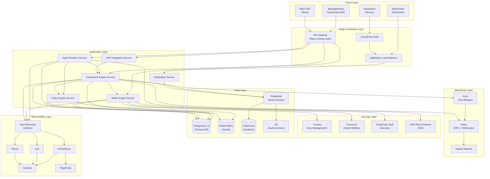

### 1.2 Architecture Principles

| Principle | Description |
|---|---|
| **Microservices** | Each domain (Agent, Wallet, Policy, Transaction, DeFi) is an independent service |
| **Event-Driven** | Async communication via Redpanda for decoupled, scalable workflows |
| **Zero Trust** | All inter-service communication authenticated via mTLS + JWT |
| **Fail Secure** | Default-deny for all policy evaluations; transactions blocked if policy engine unavailable |
| **Observability First** | Every request traced end-to-end via OpenTelemetry |
| **Infrastructure as Code** | All infra defined in Terraform; environments are reproducible |
| **Immutable Infrastructure** | Services deployed as immutable containers; rollback via image tag |

---

## 2. Component Architecture

### 2.1 Service Decomposition

| Service | Responsibility | Port | FR Reference |
|---|---|---|---|
| `agent-runtime-svc` | Agent lifecycle, LLM integration, tool orchestration | 3001 | [FR-500 series](file:///Users/mac/Downloads/solana-agent/PRD.md) |
| `wallet-engine-svc` | Wallet CRUD, key provider integration, balance tracking | 3002 | [FR-100 series](file:///Users/mac/Downloads/solana-agent/PRD.md) |
| `policy-engine-svc` | Policy evaluation, rule management, audit decisions | 3003 | [FR-300 series](file:///Users/mac/Downloads/solana-agent/PRD.md) |
| `transaction-engine-svc` | Tx building, simulation, signing, submission, tracking | 3004 | [FR-200 series](file:///Users/mac/Downloads/solana-agent/PRD.md) |
| `defi-integration-svc` | Protocol adapters (Jupiter, Raydium, Orca, etc.) | 3005 | [FR-400 series](file:///Users/mac/Downloads/solana-agent/PRD.md) |
| `notification-svc` | WebSocket push, webhook delivery, alert routing | 3006 | [FR-600 series](file:///Users/mac/Downloads/solana-agent/PRD.md) |
| `api-gateway` | Auth, rate limiting, request routing, TLS termination | 8080 | Non-functional |
| `dashboard-web` | Operator UI (Next.js SSR) | 3000 | [FR-605](file:///Users/mac/Downloads/solana-agent/PRD.md) |

---

## 3. Detailed Component Design

### 3.1 Agent Runtime Service

> **Implements**: [FR-501 through FR-507](file:///Users/mac/Downloads/solana-agent/PRD.md)  
> **Phase**: [Phase 2](file:///Users/mac/Downloads/solana-agent/ROADMAP.md)

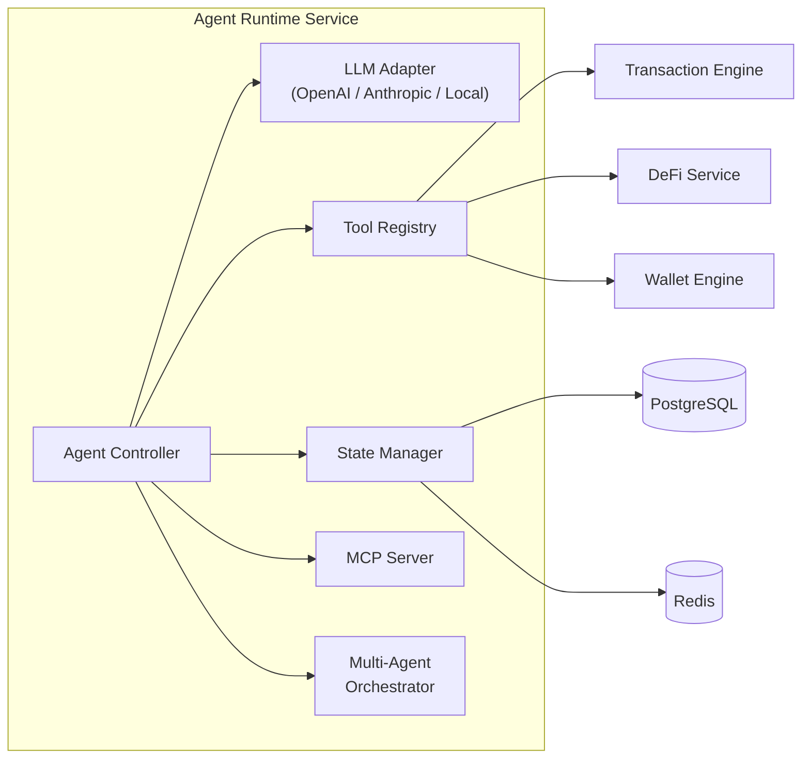

**Key Design Decisions:**

- **Tool Registry Pattern**: Agent capabilities are registered as tools (functions) that the LLM can call. Each tool maps to one or more API calls on downstream services.
- **Sandboxed Execution**: Agent logic runs in isolated V8 isolates (via `isolated-vm` or Deno-style workers) to prevent agents from accessing system resources.
- **State Persistence**: Agent conversation and memory state stored in PostgreSQL with Redis for hot-path session cache.
- **Framework Adapters**: The runtime provides adapter interfaces for LangChain, Eliza, and Vercel AI SDK, each implementing a common `AgentFramework` interface.

```typescript
// Agent Framework Interface
interface AgentFramework {
  initialize(config: AgentConfig): Promise<void>;
  registerTools(tools: Tool[]): void;
  execute(input: AgentInput): AsyncIterable<AgentOutput>;
  getState(): AgentState;
  pause(): Promise<void>;
  resume(): Promise<void>;
  destroy(): Promise<void>;
}

// Tool Interface
interface Tool {
  name: string;
  description: string;
  parameters: ZodSchema;
  execute(params: unknown): Promise<ToolResult>;
  requiredPolicies: PolicyType[];
}
```

### 3.2 Wallet Engine Service

> **Implements**: [FR-101 through FR-107](file:///Users/mac/Downloads/solana-agent/PRD.md)  
> **Phase**: [Phase 1](file:///Users/mac/Downloads/solana-agent/ROADMAP.md)

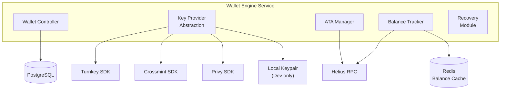

**Key Provider Abstraction Layer:**

```typescript
// Unified interface for all key management providers
interface KeyProvider {
  name: string;

  // Wallet operations
  createWallet(opts: CreateWalletOpts): Promise<WalletRef>;
  getPublicKey(walletRef: WalletRef): Promise<PublicKey>;

  // Signing operations
  signTransaction(walletRef: WalletRef, tx: Transaction): Promise<SignedTransaction>;
  signMessage(walletRef: WalletRef, message: Uint8Array): Promise<Signature>;

  // Lifecycle
  exportWallet(walletRef: WalletRef, authProof: AuthProof): Promise<EncryptedExport>;
  importWallet(encryptedExport: EncryptedExport): Promise<WalletRef>;
  destroyWallet(walletRef: WalletRef, authProof: AuthProof): Promise<void>;
}

// Provider implementations
class TurnkeyProvider implements KeyProvider { ... }
class CrossmintProvider implements KeyProvider { ... }
class PrivyProvider implements KeyProvider { ... }
class LocalProvider implements KeyProvider { ... } // Dev/test only
```

**Balance Tracking:**

- Real-time balance cached in Redis with 5-second TTL
- Helius webhooks trigger cache invalidation on balance changes
- Supports SOL + all SPL tokens via `getTokenAccountsByOwner`

### 3.3 Policy Engine Service

> **Implements**: [FR-301 through FR-308](file:///Users/mac/Downloads/solana-agent/PRD.md)  
> **Phase**: [Phase 1](file:///Users/mac/Downloads/solana-agent/ROADMAP.md)

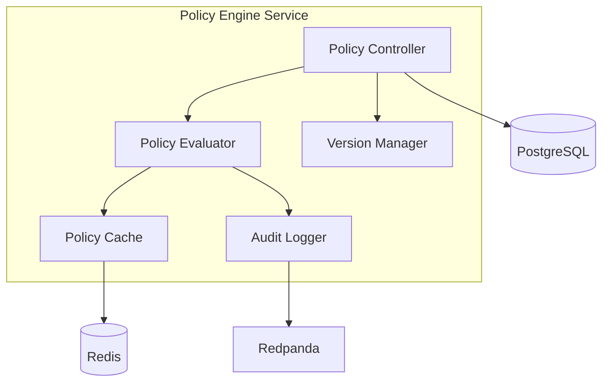

**Policy Evaluation Pipeline:**

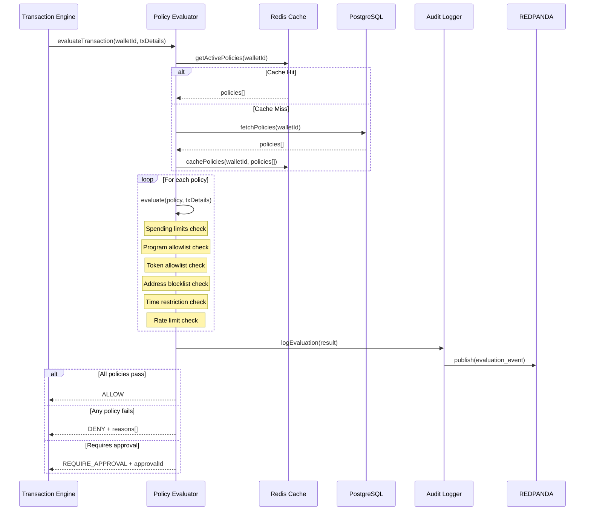

**Policy Rule Schema:**

```typescript
type PolicyRule =
  | {
      type: 'spending_limit';
      maxPerTransaction: bigint;          // lamports
      maxPerWindow: bigint;               // lamports
      windowDuration: number;             // seconds
      tokenMint: string | 'SOL';         // specific token or SOL
    }
  | {
      type: 'program_allowlist';
      allowedPrograms: string[];           // program IDs (base58)
    }
  | {
      type: 'token_allowlist';
      allowedMints: string[];              // token mint addresses
    }
  | {
      type: 'address_blocklist';
      blockedAddresses: string[];          // destination addresses
    }
  | {
      type: 'time_restriction';
      allowedWindows: TimeWindow[];        // { start: 'HH:MM', end: 'HH:MM', tz: string }
    }
  | {
      type: 'human_approval';
      triggerCondition: 'amount_exceeds' | 'program_not_in_allowlist' | 'always';
      threshold?: bigint;                  // lamports
      approvalTimeout: number;             // seconds
    }
  | {
      type: 'rate_limit';
      maxTransactions: number;
      windowDuration: number;              // seconds
    };
```

### 3.4 Transaction Engine Service

> **Implements**: [FR-201 through FR-207](file:///Users/mac/Downloads/solana-agent/PRD.md)  
> **Phase**: [Phase 1](file:///Users/mac/Downloads/solana-agent/ROADMAP.md)

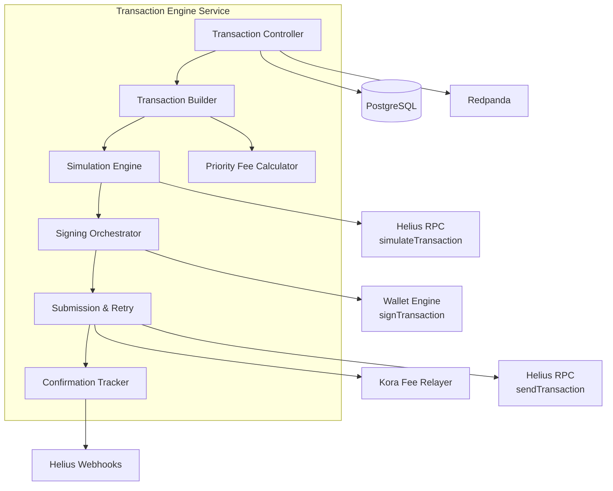

**Transaction Lifecycle State Machine:**

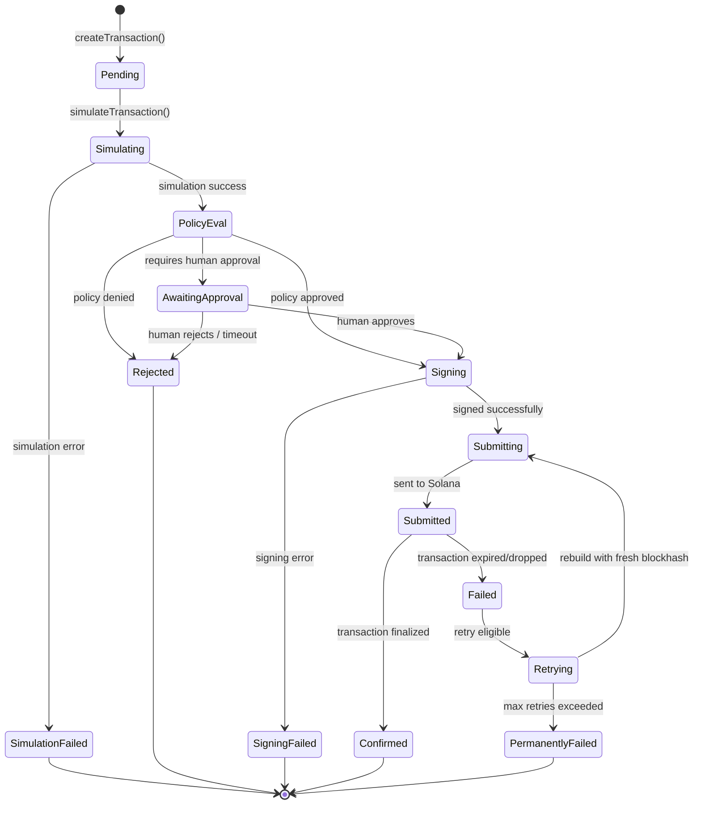

**Retry Strategy:**

| Scenario | Strategy |
|---|---|
| Blockhash expired | Rebuild transaction with new blockhash, re-sign, re-submit |
| Network congestion | Exponential backoff (100ms → 200ms → 400ms → ...) up to 5 retries |
| Simulation failure | Do not retry — surface error to agent for decision |
| Signing failure | Retry once, then fail — may indicate key provider issue |
| Rate limited by RPC | Back off for 1 second, switch to fallback RPC endpoint |

**Priority Fee Calculation:**

```typescript
async function calculatePriorityFee(
  instructions: TransactionInstruction[],
  urgency: 'low' | 'medium' | 'high'
): Promise<number> {
  // Fetch recent priority fee data from Helius
  const recentFees = await helius.getRecentPrioritizationFees(
    instructions.flatMap(ix => ix.keys.map(k => k.pubkey))
  );

  const feePercentiles = {
    low: 25,     // 25th percentile — saves cost
    medium: 50,  // 50th percentile — balanced
    high: 75,    // 75th percentile — faster inclusion
  };

  return percentile(recentFees, feePercentiles[urgency]);
}
```

### 3.5 DeFi Integration Service

> **Implements**: [FR-401 through FR-407](file:///Users/mac/Downloads/solana-agent/PRD.md)  
> **Phase**: [Phase 2](file:///Users/mac/Downloads/solana-agent/ROADMAP.md)

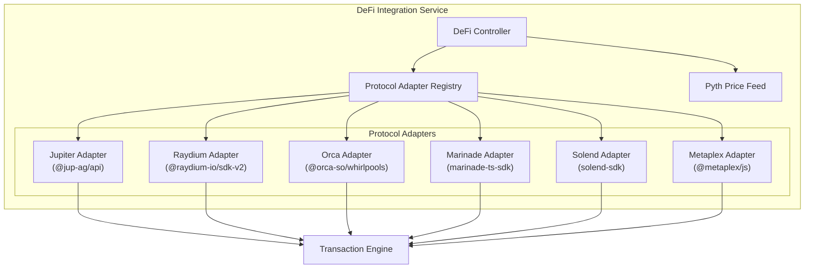

**Protocol Adapter Interface:**

```typescript
interface DeFiProtocolAdapter {
  name: string;
  programIds: string[];          // Solana program IDs this adapter interacts with

  // Swap operations
  getSwapQuote?(params: SwapQuoteParams): Promise<SwapQuote>;
  buildSwapTransaction?(params: SwapExecuteParams): Promise<TransactionInstruction[]>;

  // Liquidity operations
  getPoolInfo?(poolId: string): Promise<PoolInfo>;
  buildAddLiquidityTx?(params: LiquidityParams): Promise<TransactionInstruction[]>;
  buildRemoveLiquidityTx?(params: LiquidityParams): Promise<TransactionInstruction[]>;

  // Staking operations
  buildStakeTx?(params: StakeParams): Promise<TransactionInstruction[]>;
  buildUnstakeTx?(params: UnstakeParams): Promise<TransactionInstruction[]>;

  // Lending operations
  buildSupplyTx?(params: SupplyParams): Promise<TransactionInstruction[]>;
  buildBorrowTx?(params: BorrowParams): Promise<TransactionInstruction[]>;
}
```

### 3.6 Notification Service

> **Implements**: [FR-601 through FR-606](file:///Users/mac/Downloads/solana-agent/PRD.md)  
> **Phase**: [Phase 2](file:///Users/mac/Downloads/solana-agent/ROADMAP.md)

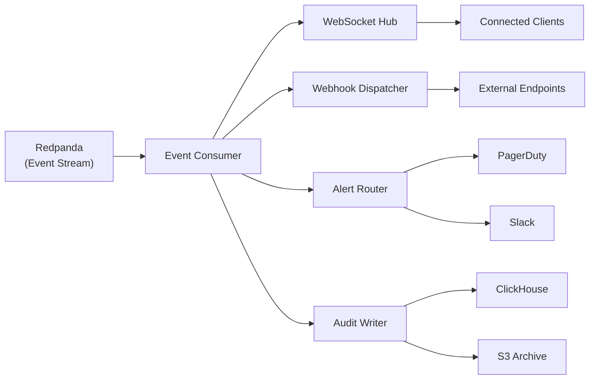

### 3.7 Dashboard (Web Application)

> **Implements**: [FR-605](file:///Users/mac/Downloads/solana-agent/PRD.md)  
> **Phase**: [Phase 2-3](file:///Users/mac/Downloads/solana-agent/ROADMAP.md)

**Page Architecture:**

| Page | Route | Purpose |
|---|---|---|
| Overview | `/dashboard` | System health, key metrics, active agent count |
| Agents | `/dashboard/agents` | Agent list, status, create/pause/destroy |
| Agent Detail | `/dashboard/agents/:id` | Agent config, logs, wallet, transaction history |
| Wallets | `/dashboard/wallets` | Wallet list, balances, key provider status |
| Transactions | `/dashboard/transactions` | Transaction log with filter/search |
| Policies | `/dashboard/policies` | Policy management, create/edit/version |
| Monitoring | `/dashboard/monitoring` | Grafana-embedded panels, alerts |
| Settings | `/dashboard/settings` | RBAC, API keys, notification config |

---

## 4. Data Architecture

### 4.1 Database Schema (PostgreSQL)

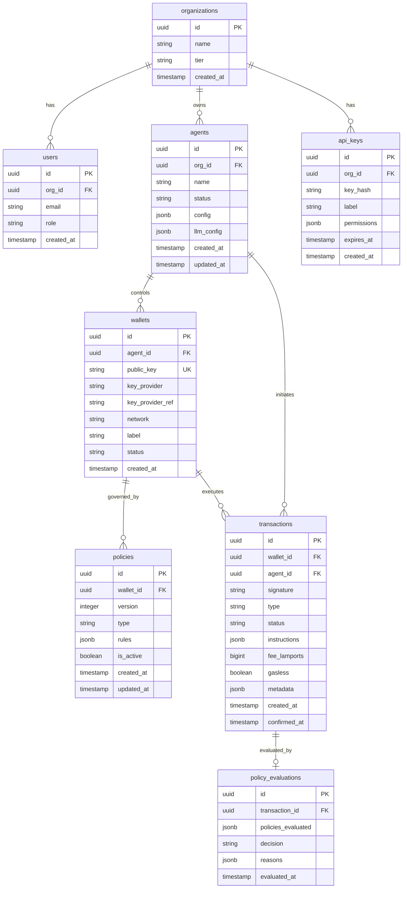

### 4.2 Event Schema (Redpanda Topics)

| Topic | Key | Schema | Consumers |
|---|---|---|---|
| `agent.lifecycle` | agentId | `{ agentId, event: 'created'|'started'|'paused'|'stopped'|'destroyed', timestamp }` | Notification, Analytics |
| `transaction.events` | walletId | `{ txId, walletId, agentId, event: 'pending'|'simulated'|'signed'|'submitted'|'confirmed'|'failed', details, timestamp }` | Notification, Analytics, Audit |
| `policy.evaluations` | walletId | `{ evalId, txId, walletId, decision, reasons[], timestamp }` | Audit, Analytics |
| `policy.violations` | walletId | `{ evalId, txId, walletId, violatedPolicies[], timestamp }` | Notification (Alert), Audit |
| `wallet.balance` | walletId | `{ walletId, token, previousBalance, newBalance, timestamp }` | Dashboard, Notification |

### 4.3 Caching Strategy (Redis)

| Key Pattern | TTL | Purpose |
|---|---|---|
| `policy:{walletId}` | 60s | Active policies for wallet (hot-reload invalidated) |
| `balance:{walletId}:{mint}` | 5s | Token balance cache |
| `ratelimit:{walletId}:{window}` | window duration | Sliding window rate limit counter |
| `session:{agentId}` | 30min | Agent session state |
| `blockhash:latest` | 500ms | Recent blockhash for transaction building |
| `priority_fees:{percentile}` | 2s | Recent priority fee estimates |

---

## 5. Security Architecture

### 5.1 Defense-in-Depth Model

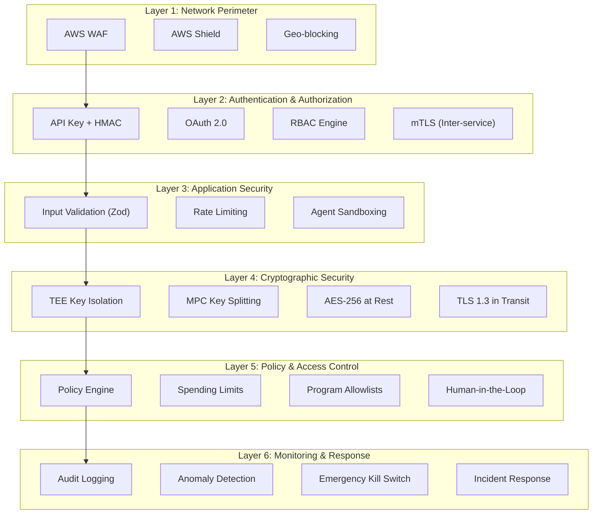

### 5.2 Key Management Architecture

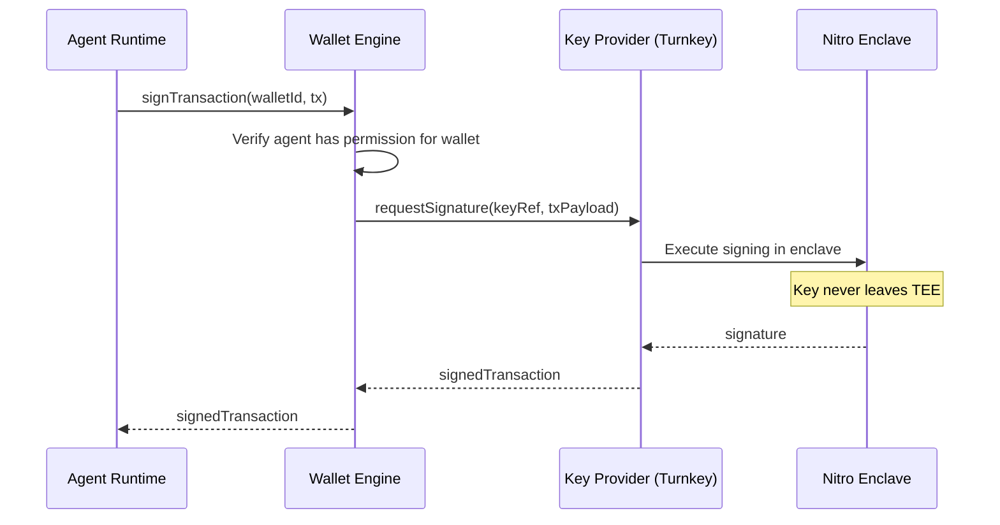

### 5.3 Authentication & Authorization

**API Authentication Flow:**

```
1. Client sends request with headers:
   - X-API-Key: <api_key>
   - X-Timestamp: <unix_timestamp>
   - X-Signature: HMAC-SHA256(api_secret, method + path + timestamp + body)

2. API Gateway validates:
   - API key exists and is not expired
   - Timestamp within 5-minute window (anti-replay)
   - HMAC signature matches
   - IP in allowlist (if configured)

3. JWT issued for downstream services:
   - Contains: orgId, permissions[], walletIds[]
   - Signed with RS256 (rotated weekly)
   - TTL: 5 minutes
```

**RBAC Matrix:**

| Role | Create Agent | View Agent | Modify Policy | Execute TX | View Audit | Manage Keys |
|---|---|---|---|---|---|---|
| Viewer | ✗ | ✓ | ✗ | ✗ | ✓ | ✗ |
| Developer | ✓ | ✓ | ✓ | ✓ | ✓ | ✗ |
| Operator | ✓ | ✓ | ✓ | ✓ | ✓ | ✓ |
| Admin | ✓ | ✓ | ✓ | ✓ | ✓ | ✓ |

### 5.4 Emergency Procedures

| Scenario | Automated Response | Manual Response |
|---|---|---|
| Anomalous spending detected | Freeze wallet, alert operator | Investigate, unfreeze or rotate keys |
| Key provider outage | Queue transactions, alert | Switch to backup provider |
| Policy engine unavailable | **DENY ALL transactions** | Restore service, drain queue |
| Solana network congestion | Increase priority fees, queue | Monitor, adjust fee strategy |
| Agent logic compromise | Kill agent, freeze wallets | Forensic analysis, rotate keys |

---

## 6. Infrastructure Architecture

### 6.1 AWS Deployment Topology

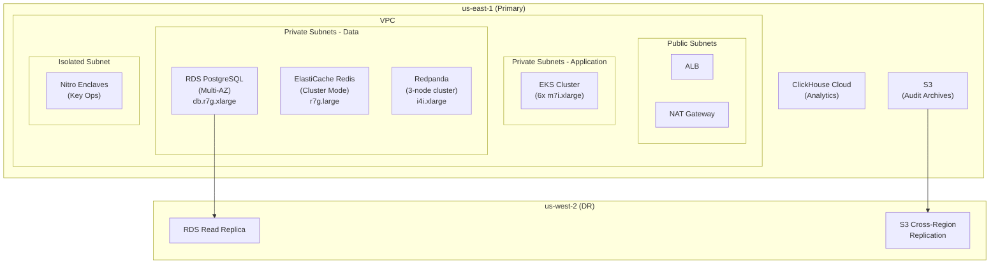

### 6.2 Kubernetes Architecture

```yaml
# Namespace organization
namespaces:
  - solagent-core          # Agent, Wallet, Transaction services
  - solagent-policy        # Policy Engine (isolated for security)
  - solagent-defi          # DeFi integration adapters
  - solagent-notification  # WebSocket hub, webhook dispatch
  - solagent-observability # Prometheus, Grafana, OTel collector
  - solagent-dashboard     # Next.js dashboard

# Resource allocation per service
resources:
  agent-runtime-svc:
    replicas: 3-20 (HPA)
    cpu: 500m-2000m
    memory: 512Mi-2Gi
    
  wallet-engine-svc:
    replicas: 3-10 (HPA)
    cpu: 250m-1000m
    memory: 256Mi-1Gi
    
  policy-engine-svc:
    replicas: 3-10 (HPA)
    cpu: 250m-1000m
    memory: 256Mi-512Mi
    
  transaction-engine-svc:
    replicas: 3-15 (HPA)
    cpu: 500m-2000m
    memory: 512Mi-2Gi
    
  defi-integration-svc:
    replicas: 2-8 (HPA)
    cpu: 250m-1000m
    memory: 256Mi-1Gi
```

### 6.3 Scaling Strategy

| Trigger | Action | Config |
|---|---|---|
| CPU > 70% for 2 min | Scale out pods | HPA, max 20 replicas |
| Request queue depth > 100 | Scale out pods | KEDA, Redpanda consumer lag |
| Active agents > 5000 per node | Scale out EKS nodes | Cluster Autoscaler |
| Database connections > 80% pool | Add read replica | Manual / Terraform |
| Redis memory > 80% | Scale up instance | Manual / Terraform |

---

## 7. Network & Communication Architecture

### 7.1 Inter-Service Communication

| Communication Type | Protocol | Use Case |
|---|---|---|
| Synchronous request/response | gRPC over mTLS | Policy evaluation, signing requests |
| Async event notification | Redpanda (Kafka protocol) | Transaction events, audit logs |
| Real-time push | WebSocket (via Hono upgrade) | Dashboard updates, agent events |
| External webhooks | HTTPS POST with HMAC signing | Developer notification callbacks |

### 7.2 Service Mesh

```
Istio Service Mesh
├── mTLS between all services (automatic)
├── Circuit breaker: 5 consecutive 5xx → open for 30s
├── Retry policy: max 3 retries, 25ms-100ms jitter
├── Timeout: 5s default, 30s for signing operations
└── Rate limiting per service:
    ├── policy-engine-svc: 10,000 req/s
    ├── transaction-engine-svc: 5,000 req/s
    └── wallet-engine-svc: 2,000 req/s
```

---

## 8. Observability Architecture

### 8.1 Three Pillars

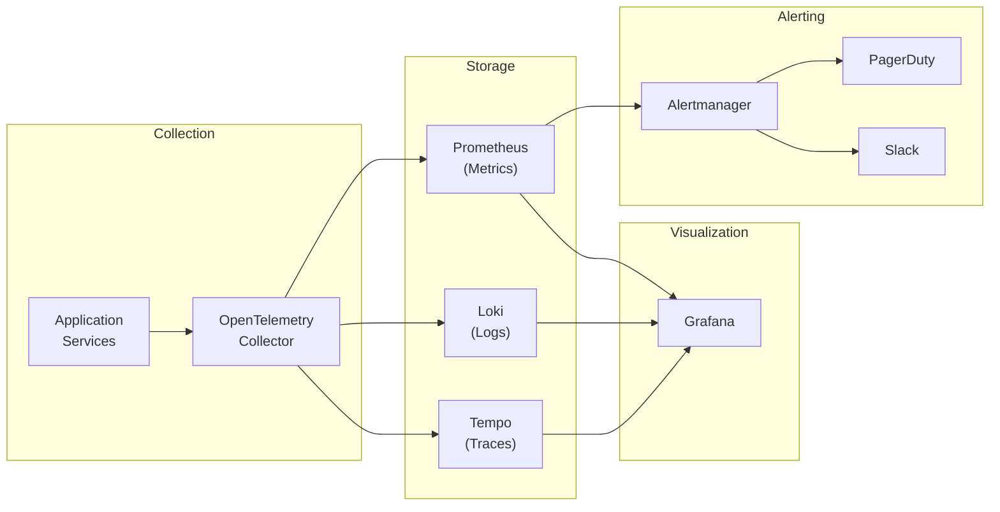

### 8.2 Key Metrics & SLOs

| Metric | SLO | Alert Threshold |
|---|---|---|
| Transaction success rate | >99.5% | <99% for 5 min |
| Policy evaluation latency (p99) | <10ms | >20ms for 5 min |
| Transaction signing latency (p99) | <100ms | >200ms for 5 min |
| API error rate (5xx) | <0.1% | >0.5% for 5 min |
| Agent runtime uptime | >99.95% | Any downtime |
| Fee relayer SOL balance | >5 SOL | <2 SOL |
| Database connection pool utilization | <80% | >90% for 2 min |

### 8.3 Grafana Dashboard Panels

| Dashboard | Key Panels |
|---|---|
| **System Overview** | Active agents, TPS, success rate, latency heatmap |
| **Transaction Deep Dive** | Tx lifecycle funnel, failure reasons, retry rate |
| **Policy Engine** | Evaluation rate, deny rate, top violation reasons |
| **Wallet Health** | Balance trends, token distribution, wallet count |
| **Infrastructure** | CPU/memory, pod count, DB connections, Redis hit rate |

---

## 9. Disaster Recovery & Business Continuity

### 9.1 Recovery Targets

| Metric | Target | Strategy |
|---|---|---|
| **RTO** | <5 minutes | Kubernetes self-healing + multi-AZ |
| **RPO** | <30 seconds | Synchronous RDS replication + Redpanda |
| **Data Backup** | Hourly snapshots, 30-day retention | RDS automated backups + S3 |
| **Geo-redundancy** | us-east-1 primary, us-west-2 DR | Cross-region RDS replica + S3 replication |

### 9.2 Failure Scenarios & Responses

| Failure | Detection | Automated Response | RTO |
|---|---|---|---|
| Single pod crash | K8s liveness probe | Restart pod | <30s |
| AZ failure | ALB health checks | Route to healthy AZ | <60s |
| RDS primary failure | RDS multi-AZ | Automatic failover | <2 min |
| Redis node failure | Sentinel/Cluster | Automatic failover | <30s |
| Helius RPC outage | Health check failure | Switch to backup RPC (QuickNode) | <10s |
| Key provider outage | API health check | Queue transactions, alert | <5 min |
| Full region failure | Route53 health check | DNS failover to DR region | <10 min |

---

## 10. Technology Decision Log

| Decision | Options Considered | Chosen | Rationale |
|---|---|---|---|
| Backend runtime | Node.js, Deno, Bun | **Bun** | Fastest startup, native TS, growing ecosystem |
| API framework | Express, Fastify, Hono | **Hono** | Edge-compatible, lightweight, excellent perf |
| Database | PostgreSQL, CockroachDB, PlanetScale | **PostgreSQL** | Mature, JSONB support, best tooling |
| Event streaming | Kafka, Redpanda, NATS | **Redpanda** | Kafka-compatible, no JVM, lower resource usage |
| Key management | Turnkey, Fireblocks, custom HSM | **Turnkey** | Solana-native, sub-100ms signing, policy engine |
| Fee relayer | Kora, custom relayer | **Kora** | Solana Foundation-backed, production-proven |
| RPC provider | Helius, QuickNode, Alchemy | **Helius** (primary) | Best Solana APIs, DAS, webhooks, MCP server |
| Analytics DB | ClickHouse, TimescaleDB | **ClickHouse** | Fastest for analytical queries, column-oriented |
| Container orchestration | ECS, EKS, Nomad | **EKS** | Industry standard, best tooling, Istio support |
| IaC | Terraform, Pulumi, CDK | **Terraform** | Most mature, largest community, state management |

---

## Appendix A: Directory Structure

```
solana-agent/
├── apps/
│   ├── api-gateway/              # Hono API gateway
│   ├── dashboard/                # Next.js 15 dashboard
│   └── mcp-server/               # MCP server for AI integrations
├── services/
│   ├── agent-runtime/            # Agent lifecycle & LLM integration
│   ├── wallet-engine/            # Wallet CRUD & key provider abstraction
│   ├── policy-engine/            # Policy evaluation & management
│   ├── transaction-engine/       # Tx building, signing, submission
│   ├── defi-integration/         # Protocol adapters
│   └── notification/             # WebSocket, webhooks, alerts
├── packages/
│   ├── sdk/                      # @solagent/sdk (TypeScript SDK)
│   ├── common/                   # Shared types, utils, constants
│   ├── db/                       # Drizzle schema & migrations
│   ├── events/                   # Event schemas & Redpanda client
│   └── policy-rules/             # Policy rule definitions & validators
├── programs/                     # Solana programs (Anchor/Rust)
│   └── smart-wallet/             # On-chain smart wallet program
├── infrastructure/
│   ├── terraform/                # AWS infrastructure (EKS, RDS, etc.)
│   ├── kubernetes/               # K8s manifests & Helm charts
│   └── docker/                   # Dockerfiles for all services
├── docs/
│   ├── PRD.md                    # This document
│   ├── SYSTEM_ARCHITECTURE.md    # Architecture (this file)
│   ├── IMPLEMENTATION_PLAN.md    # Phase-by-phase plan
│   └── ROADMAP.md                # Milestone tracking
└── turbo.json                    # Turborepo config
```

---

## Appendix B: External Dependencies & SLAs

| Dependency | SLA | Fallback | Impact if Down |
|---|---|---|---|
| Solana Network | ~99.5% historically | None — core dependency | All transactions halt |
| Helius RPC | 99.9% | QuickNode (secondary) | Degraded performance |
| Turnkey | 99.9% | Crossmint or queue | Signing delayed |
| Kora | Best-effort | Direct RPC submission (agent pays gas) | UX degraded, not blocked |
| AWS EKS | 99.95% | Multi-AZ | Self-healing |
| AWS RDS | 99.95% | Multi-AZ failover | Brief interruption |
